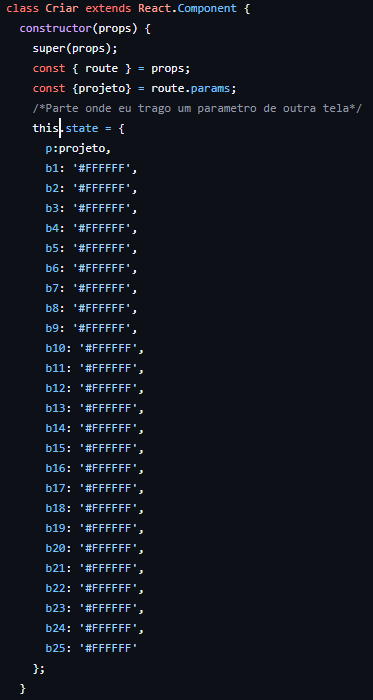
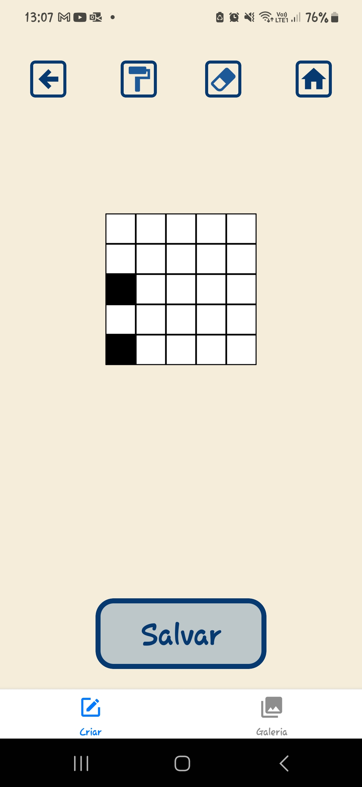

# Relatório Final

Nome: Luana Bortko Rodrigues
RA: 24.123.006-9

# Introdução

Este relatório apresenta o desenvolvimento e os resultados do projeto realizado para a disciplina CC4670. O projeto consiste na criação de um aplicativo em React Native, abordando o tema pixelart. O aplicativo visa ser uma interface para a criação de desenho no estilo pixel art, voltado ao público que tem interesse nesse estilo de arte.

# Motivação

A escolha por desenvolver um aplicativo sobre pixel art surgiu a partir de uma necessidade pessoal de um aplicativo de pixel art do conforto de um celular, para aprimorar minhas habilidades neste tipo de desenho. Outro motivo foi a oportunidade de um aprofundamento maior no React Native, e o Async Storage e a possibilidade de me desafiar mais no contexto desses dois temas.

# Objetivo

O objetivo principal deste projeto é desenvolver um aplicativo mobile funcional em React Native que é possível desenhar por pixels, como também salvar esses desenhos na memória do dispositivo.

Além disso, o projeto busca:

- Implementar funcionalidades de desenhar, guardar e editar desenhos no estilo pixel art 
- Utilizar o Async Storage para ler e guardar desenhos feitos no aplicativo.
- Integrar o aplicativo com o atuador de vibração para indicar ao usuário que o desenho realmente foi salvo.
- Proporcionar uma experiência de usuário intuitiva e agradável.

# Funcionalidades

O aplicativo desenvolvido conta com as seguintes funcionalidades:

**Tela de escolha**: tela em que o usuário escolhe qual projeto vai editar e é redirecionado à tela “Criar”  
  
- **Funcionamento**: Dependendo do botão escolhido pelo usuário (projeto), o código passa um valor como parâmetro para o componente “Criar”. Exemplo: se o usuário clicar no botão “Projeto1”, o componente “Criar” terá o estado de sua variável `p` setada como 1.
 Componente "Projetos"  Construtor da pagina "Criar"

**Desenhar**: Ao clicar nos quadrados na tela “Criar”, o usuário troca a cor dos quadrados. Se estiver branco, troca para preto, e se estiver preto, troca para branco  
 
- **Funcionamento**: O componente “Criar” contém em seu construtor o estado de todos os botões/pixels (`b1`, `b2`… `b25`), que guardam em si a cor do botão, iniciando todos como branco (`#FFFFFF`). Ao clicar no botão, será chamada a função `pintar(id)`, que requer como parâmetro qual botão foi pressionado. A função apenas compara: se o estado do botão é branco, ele troca para preto (`#000000`); se não, troca para branco (`#FFFFFF`). E, por fim, a partir do estado do botão é definida a cor de seu background.  
 Construtor da "Criar"  Função pintar() ) Alguns dos botões que simulam pixels

**Apagar**: Na tela “Criar”, temos a possibilidade de apagar totalmente o desenho que está nela por meio de um botão com símbolo de borracha.  
  
- **Funcionamento**: Ao apertar o botão com símbolo de borracha, a função `apagar()` é chamada, que altera o estado de todos os botões para branco (`#FFFFFF`).  
 Função apagar()

**Pintar todo o fundo**: Na tela “Criar”, temos a possibilidade de pintar totalmente o desenho de preto por meio de um botão com símbolo de rolo de tinta.  
 
- **Funcionamento**: Ao apertar o botão com símbolo de rolo de tinta, a função `fundo()` é chamada, que basicamente tem a mesma lógica da função apagar, alterando o estado de todos os botões para preto (`#000000`).  
 Função fundo()

**Salvar o desenho**: Estando na tela “Criar”, existe o botão “Salvar”, que ao clicar mostra um alerta avisando que o desenho foi salvo com sucesso, seguido de uma vibração. Quando salvo com sucesso, o desenho é guardado na memória do dispositivo (com o Async Storage).  
- **Funcionamento**: Ao clicar no botão “Salvar”, a função `gravar()` é chamada, com o objetivo de guardar os estados atuais dos botões (`b1`, `b2`… `b25`) em um item de nome “estados_pn”, em que `n` é o projeto que o usuário está editando, passado pelo atual estado de `p` do componente “Criar”. Esse item é então salvo no Async Storage e, se a operação ocorreu com sucesso, um alerta informa que foi salvo com sucesso, e uma função `vibracao()` é chamada para fazer o celular vibrar, usando `Haptics.notificationAsync(Haptics.NotificationFeedbackType.Success)` em um `for` para tornar a vibração mais aparente.  
 Função gravar()  Função vibracao()

**Ver os desenhos salvos**: Na tela “Galeria” é possível ver o que foi salvo na memória, navegando pelos projetos do 1 ao 4. Também, quando se está na tela “Criar” e já havia algum desenho salvo na memória do projeto escolhido, esse desenho será carregado novamente, permitindo ao usuário a chance de “editá-lo” em vez de refazê-lo do zero.  
 ---->  
- **Funcionamento**: O carregamento dos desenhos salvos acontece pela função `ler()`, contida dentro da função `componentDidMount()`, garantindo que, sempre que a tela é aberta, o que está na memória será lido. A função `ler()` ajusta os estados dos botões (`b1`, `b2`… `b25`) da tela atual para os estados salvos na memória.  
 Função ler()

# Conclusão

A partir do desenvolvimento deste projeto, os objetivos propostos foram concluídos com sucesso. Um dos maiores desafios enfrentados foi o tempo limitado e a falta de conhecimento em algumas áreas do React Native. No entanto, ao longo do processo, adquiri muitos conhecimentos sobre essa ferramenta, o que fez deste projeto um grande passo para o meu aprendizado. Se houvesse mais tempo uma melhoria a ser implementada neste projeto seria a melhora na otimização, principalmente na parte dos botões(b1…b25), e com isso aumentar o número de pixels que o usuário pode utilizar. 
